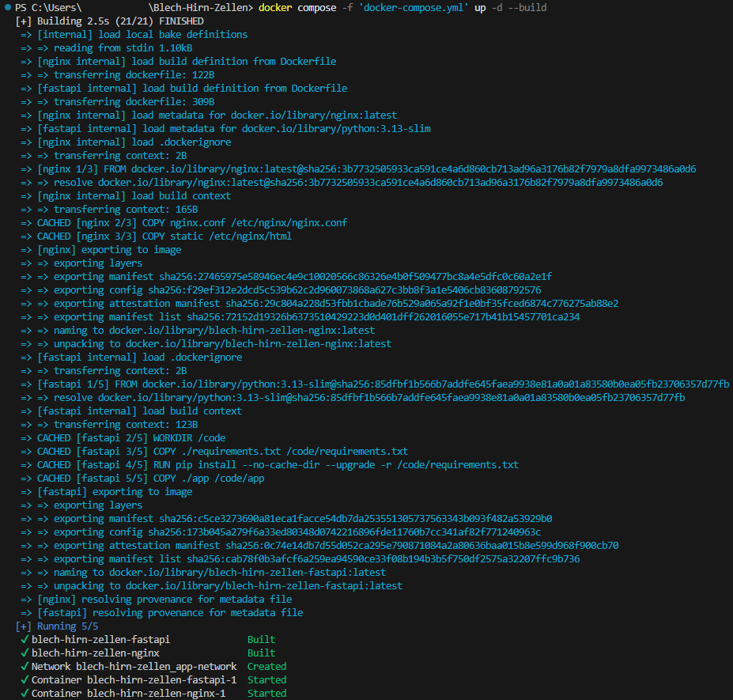
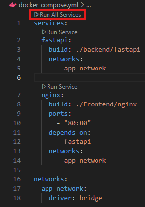
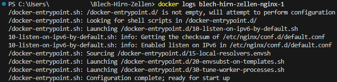
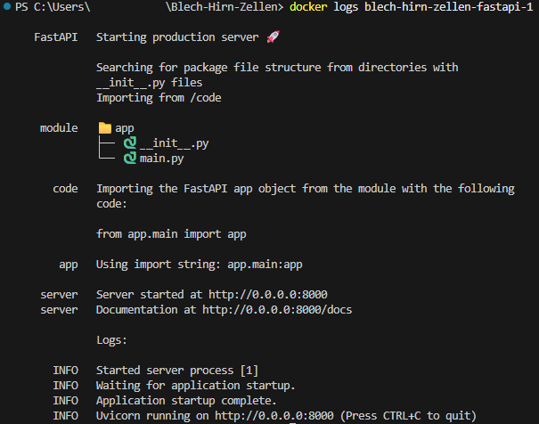

# Blech-Hirn-Zellen
The goal of this project is to create an online game that is similar to the board game Ricochet Robots.
It's a puzzle game where players must calculate the shortest possible sequence of moves to get a specific
robot to a target destination on the board. The twist? Robots move in a straight line and don't stop until
they hit another robot or a wall.

## Installation
1. Clone the repo into a local directory -> e.g. `git clone https://github.com/husiatin/Blech-Hirn-Zellen.git`
2. If Docker / Docker compose is installed navigate to the root directory and execute the docker-compose.yml file using `docker compose -f 'docker-compose.yml' up -d --build`


If only one container should be started use:
`docker compose -f 'docker-compose.yml' up -d --build 'fastapi'` for the FastApI / backend or
`docker compose -f 'docker-compose.yml' up -d --build 'nginx'` for the web server / frontend

Alternativly use Visual Studio Code:
1. Open the docker-compose.yml file
2. Click "Run All Services" or "Run Service" if only a specific container should be created


## How to play
TODO

## Application structure
```
Blech-Hirn-Zellen/
│   docker-compose.yml
│   README.md
│
├───backend
│   └───fastapi
│       │   Dockerfile
│       │   requirements.txt
│       │
│       └───app
│               main.py
│               __init__.py
│
├───documentation_images
│       docker_compose.png
│       fastapi_container_logs.png
│       nginx_container_logs.png
│       run_all_services.png
│
└───Frontend
    └───nginx
        │   Dockerfile
        │   nginx.conf
        │
        └───static
            │   index.html
            │   styles.css
            │
            └───js
                    app.js
                    quadrantData.js
```

## Looking at the containers logs
When the application doesn't work like it should it is a good idea to look at the logs of the containers first.
To access the containers logs the following commmands can be entered into the command line.
Exchange "name-of-container" with the actual name your container.

Nginx logs: `docker logs name-of-container-nginx-1`


FastAPI logs: `docker logs name-of-container-fastapi-1`


To get a continued stream of the logs add `--follow` to the command e.g.: `docker logs --follow name-of-container-nginx-1`

## Frontend
### nginx
The nginx server serves both as the web server - suppling the frontend for the user to play the game - and a reverse proxy which allows the game to accesses the api.
Configuration of the nginx server is done in the nginx.conf file. The routes to the static files and the api are setup within the server section of this nginx.conf.

#### reverse proxy to FastAPI
The reverse proxy forwards the request to the FastAPI when the path http://127.0.0.1/api/ is navigated to.
#### web server to serve the static frontend files
Serves the static files (e.g. index.html) when the users navigate to the root path (i.e. http://127.0.0.1/).


## Backend
### FastAPI
The documentation of the api can be accessed by navigating to http://127.0.0.1/api/docs/.

## Docker
There are two Dockerfiles. One for creating the FastAPI container and the other for creating the nginx server.
Additionally, there is a docker-compose.yml file that creates the two containers based on the two Dockerfiles and setups a network through which the containers communicate with each other.