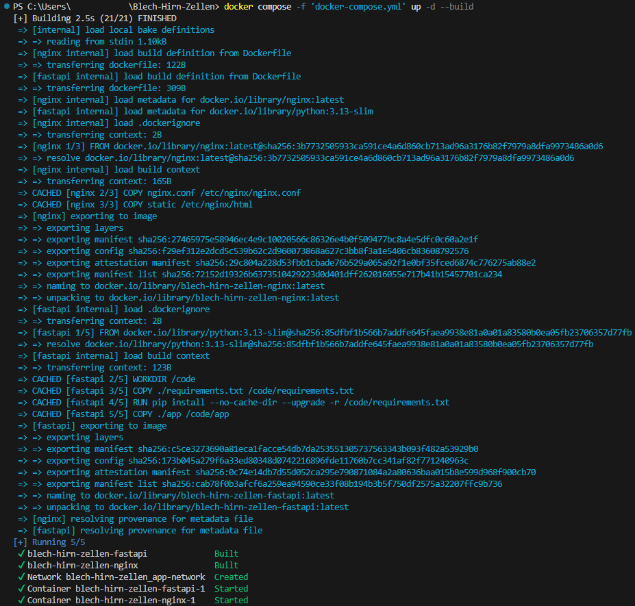
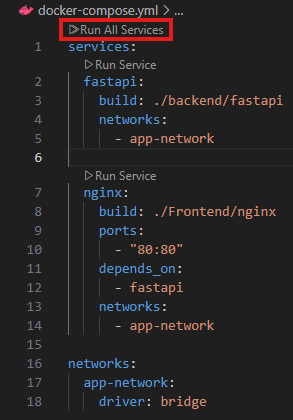
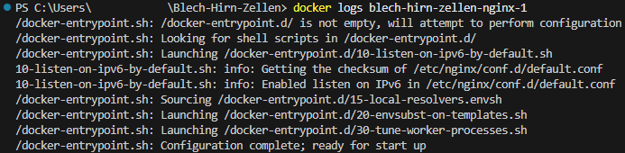
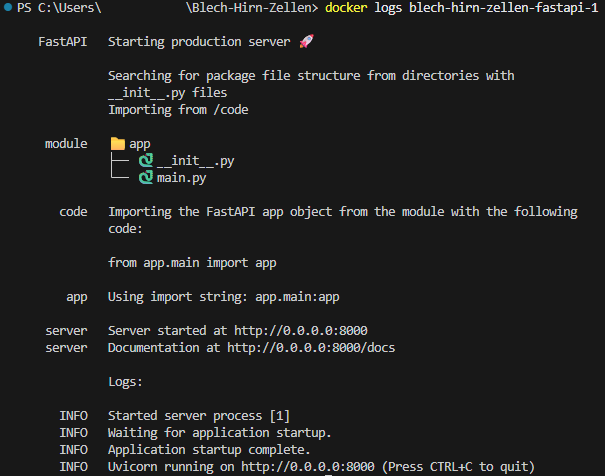

# Blech-Hirn-Zellen

Blech-Hirn-Zellen is an online puzzle game inspired by the board game Ricochet Robots.
Players try to find the shortest sequence of moves that brings the matching robot to the
current target field. Robots move horizontally or vertically and keep sliding until they
hit a wall or another robot.

## Requirements

- Docker with Docker Compose
- A modern browser

## Installation

1. Clone the repository:

   ```sh
   git clone https://github.com/husiatin/Blech-Hirn-Zellen.git
   cd Blech-Hirn-Zellen
   ```

2. Build and start the application:

   ```sh
   docker compose up -d --build
   ```

3. Open the game in your browser:

   - Frontend: <http://localhost:8080/>
   - Game guide: <http://localhost:8080/guide.html>
   - FastAPI documentation: <http://localhost:8080/api/docs>



To start only one service, run one of these commands:

```sh
docker compose up -d --build fastapi
docker compose up -d --build nginx
```

Alternatively, open `docker-compose.yml` in Visual Studio Code and use `Run All Services`
or `Run Service`.



## How to play

1. Open the lobby and enter your player name.
2. Choose the board quadrants. Each of the four quadrants can use side A or side B.
3. Create a game. The creator becomes the game master and receives a game ID.
4. Share the game ID with other players. They can enter it in the lobby to join.
5. The game master starts the game.
6. In each round, a target chip is selected. Move the robot with the matching color to the
   target field in as few moves as possible.
7. Select a robot with the mouse or touch input. With keyboard controls, use the arrow keys
   to move the selected robot. A robot slides until it reaches a wall or another robot.
8. Submit a bid when you have found a solution. The bid is the number of moves you need.
9. After the timer ends, the best bidder has to demonstrate the solution on the board. If the
   solution is valid, that player wins the target chip.
10. The game continues until all target chips are resolved. The player with the most chips wins.

The in-browser guide contains a more detailed German explanation with screenshots:
<http://localhost:8080/guide.html>.

## Application structure

```text
Blech-Hirn-Zellen/
|-- docker-compose.yml
|-- LICENSE
|-- README.md
|-- backend/
|   `-- fastapi/
|       |-- Dockerfile
|       |-- requirements.txt
|       |-- app/
|       |   |-- core.py
|       |   |-- core_adapter.py
|       |   |-- game.py
|       |   |-- main.py
|       |   |-- models.py
|       |   |-- notifications.py
|       |   |-- routes.py
|       |   `-- utils.py
|       `-- board_presets/
|           `-- default.json
|-- documentation_images/
|   |-- docker_compose.png
|   |-- fastapi_container_logs.png
|   |-- nginx_container_logs.png
|   `-- run_all_services.png
`-- Frontend/
    `-- nginx/
        |-- Dockerfile
        |-- nginx.conf
        `-- static/
            |-- guide.html
            |-- index.html
            |-- styles.css
            |-- images/
            `-- js/
                |-- board.js
                |-- constants.js
                |-- dom.js
                |-- main.js
                |-- network.js
                |-- robots.js
                |-- state.js
                `-- ui.js
```

## Container logs

When the application does not behave as expected, check the container logs first:

```sh
docker compose logs nginx
docker compose logs fastapi
```

For a continued log stream, add `--follow`:

```sh
docker compose logs --follow nginx
docker compose logs --follow fastapi
```





## Frontend

The nginx container serves the static frontend and acts as a reverse proxy for the backend.
Static files are served from `/`, while API and websocket requests are forwarded under `/api/`.

Relevant paths:

- Frontend entry point: `Frontend/nginx/static/index.html`
- Game guide: `Frontend/nginx/static/guide.html`
- Frontend scripts: `Frontend/nginx/static/js/`
- nginx configuration: `Frontend/nginx/nginx.conf`

## Backend

The backend is a FastAPI application. It manages players, games, bids, board state, and
websocket notifications for multiplayer updates.

Relevant paths:

- API entry point: `backend/fastapi/app/main.py`
- REST routes: `backend/fastapi/app/routes.py`
- Game state and rules: `backend/fastapi/app/game.py`
- Core board logic: `backend/fastapi/app/core.py`
- API models: `backend/fastapi/app/models.py`

The API documentation is available at <http://localhost:8080/api/docs> while the containers
are running.

## Docker

The project uses two containers:

- `fastapi`: runs the backend on port `8000` inside the Docker network
- `nginx`: serves the frontend on <http://localhost:8080/> and proxies requests to FastAPI

Both services are connected through the `app-network` network defined in `docker-compose.yml`.
